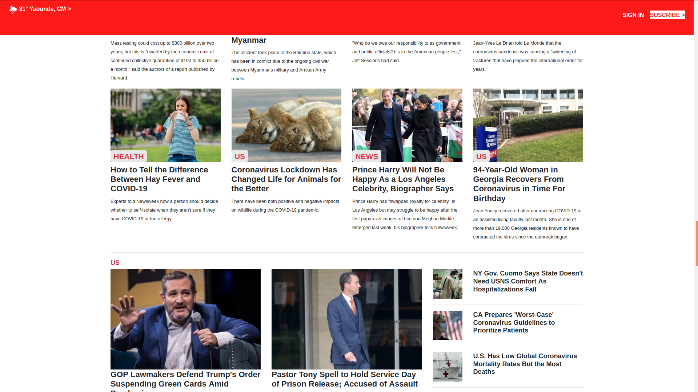

> This is a responsive cloned webpage of thenewsweek.com

# The news week-clone
TNW-clone using bootstrap

> This is a visual hierarchy heat-map of the Smashing Magazine home page

## Built With

- HTML 5
- CSS 3
- Bootstrap

## Live Demo

[Live Demo Link](https://abdoulaye-thespy.github.io/TNW-clone/)

## Getting Started

To get a local copy up and running follow these steps:

### Prerequisites

A browser (preferably Chrome)

### Usage

- Fork/Clone this project to your local machine
- Open index.html in your browser

## Author

👤 **Njgouh Abdoulaye Razak**

- Github: [@AbdoulayeRazak](https://github.com/Abdoulaye-Thepsy)

## 🤝 Contributing

Contributions, issues and feature requests are welcome!

Start by:

- Forking the project
- Cloning the project to your local machine
- `cd` into the project directory
- Run `git checkout -b your-branch-name`
- Make your contributions
- Push your branch up to your forked repository
- Open a Pull Request with a detailed description to the development(or master if not available) branch of the original project for a review

## Show your support

Give a ⭐️ if you like this project!

## Acknowledgments

- The Odin project for the project plan
- sanitize.css creators for the web reset
- w3school.com
- https://www.thenextweb.com/

## 📝 License

This project is [MIT](LICENSE.md) licensed
